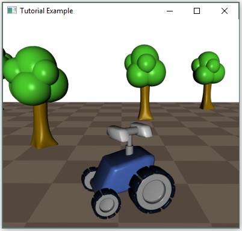
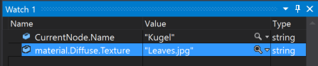
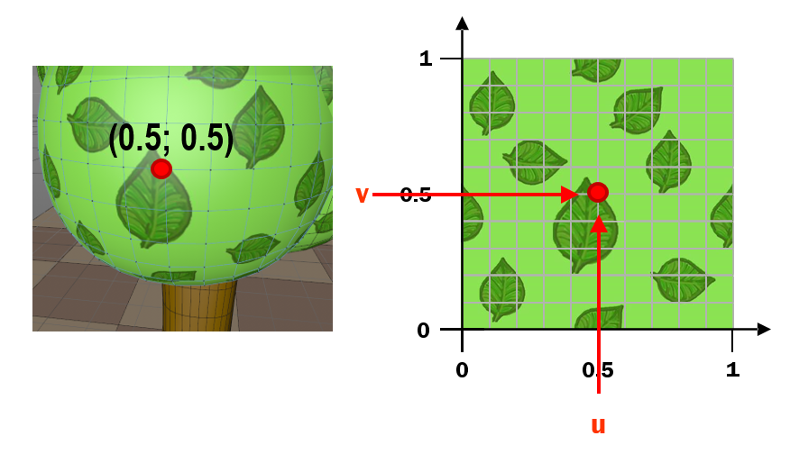
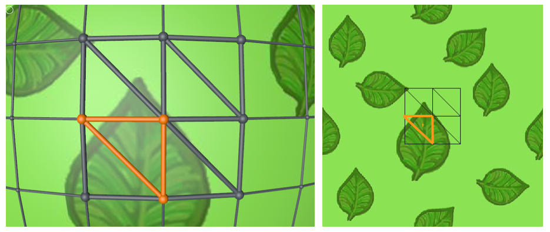
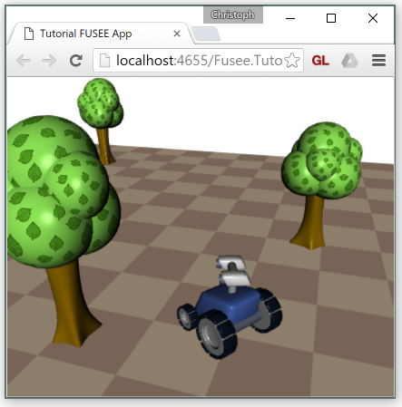
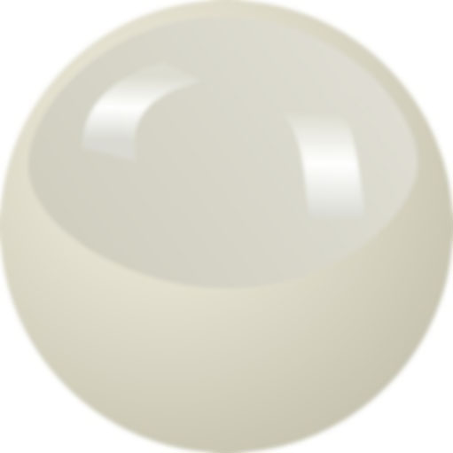

#Tutorial 06

##Goals
 - See how textures can be made available in the pixel shader.
 - Understand texture coordinates as part of the geometry.
 - Understand the interplay between shaders, multiple render passes and render state. 
 
##Welcome to WuggyLand
Open the Tutorial 06 solution in Visual Studio and build and run it. A little interactive scene
has been created around the Wuggy rover. Using the `W`, `A`, `S` and `D` keys, 
you can now move the rover around the checkerboard-like ground plane.



The entire scene is now contained in one single '.fus' file. All parts of 
the scene that need to be altered at run-time are identified by unique 
object names.
  
But let's look at the things that additionally changed under the hood.
 - The [Pixel Shader](Core/Assets/PixelShader.frag) now contains a more sophisticate
   specular color handling and an additional handling for setting an ambient color.  
 ```C# 
 uniform float specfactor;
 uniform vec3 speccolor;
 uniform vec3 ambientcolor;
 // ...
 intensitySpec = specfactor * pow(max(0.0, dot(h, nnormal)), shininess);
 gl_FragColor = vec4(ambientcolor + intensityDiff * albedo + intensitySpec * speccolor, 1);
 ```
 - These new parameters are set from respective entries in the various material
   components present in the WuggyLand.fus file. This happens in the now [extended
   `OnMaterial()` method found in Tutorial.cs](Core/Tutorial.cs#L78-L108).
   
###Practice
 - Take a look at the new Pixel Shader and try to figure out what the new
   `uniform` parameters do. Compare the changes to the [Pixel Shader from the 
   previous tutorial](../Tutorial05Completed/Core/Assets/PixelShader.frag). Temporarily
   comment out parts of the final color calculation to see their individual
   contribution.
 - Set a breakpoint within `OnMaterial()` and step through the various materials
   in `WuggyLand.fus`. Watch the `CurrentNode.Name` property to identify which material
   is used on which object and step into the various `if` and `else` clauses
   to see how different materials can be. 
 - Explain how the emissive component is used here. What would happen if our material
   handling / Pixel Shader ignored the emissive component?
 - Also watch the contents of the `material` component currently visited. What other 
   information is contained here which is currently NOT handled?

###A Hint on Debugging
Since we are using FUSEE's built-in `Visitor` to traverse the scene graph, the debugger
will end up at some awkward code place deep in FUSEE whenever a run-time error occurs
during scene traversal in one of our `On...()` visitor methods.

You can change this behavior in Visual Studio by opening the Debug->Windows->Exception Settings 
window and check the 'Common Language Runtime Exception' group. Now your application might 
report Exceptions on startup (e.g. in OpenTK). You can selectively ignore these exceptions as
they appear in the Exception Details window. As a result, you should end-up at more specific
places with a traceable stack back to your own `On...()` visitor method causing the exception.  
   
##Adding texture information
In `WuggyLand.fus`, the green parts of the tree models are already prepared
to show a very simple leaf-like structure by displaying an image spread 
over the rounded shapes. If you performed the last point of the Practice block 
above, you might have noticed that several material components contain a
non-null entry in the `Diffuse.Texture` property.



This string property
contains a file name of an image: `Leaves.jpg`. You can take a look
at this image at its [location in the `Core/Assets` Subfolder](Core/Assets/Leaves.jpg)


Now the material tells us to display this image on the green roundis treetop
models. To do this, we have to accomplish two things:

 1. Allow the PixelShader to access the pixels inside `Leaves.jpg`.
 2. Tell the PixelShader for each screen pixel (a.k.a "Fragment") it is about
    to render, which pixel from the texture `Leaves.jpg` (a.k.a "Texel") it should take 
    as the `albedo`.
    
###Textures are `uniform` Shader Parameters
Everything that controlled the process how a vertex shader proceesses coordinates or how
a pixel shader calculates the color for a given screen pixel was passed into the shader 
as a `uniform` parameter. We have seen single `float` values, `float3` values (used as
colors)  and `float4x4` matrix values. 
 
Since a texture is _quite_ something that influences the way an output color should be
calcualted, it is a `uniform` parameter as well. Because there is much more  data behind 
such a `uniform` parameter than in the cases before, there are some things that are different
compared to 'ordinary' `uniform` parameters:

 - We want to be able to read the contents of a texture image from file.
 - We want to be able to upload the texture contents to the GPU memory and
   'address' it somehow when needed rather than uploading all the pixels contained
   in a texture evrey frame.

FUSEE has some functionality we can use to do this. Perform the following steps:

 - First of all, add `Leaves.jpg` to the `Fusee.Tutorial06.Core` project's Asset folder
   and set its properties to `Content` and `Copy if newer`.
 - In the constructor of our `Renderer` class, get the asset's contents as an instance
   of the [`ImageData` structure](https://github.com/FUSEEProjectTeam/Fusee/blob/develop/src/Base/Common/ImageData.cs).
   and use the `RenderContext.CreateTexture()` method to upload the image to the GPU and get an 
   identifier for it 
   
   ```C#
   ImageData leaves = AssetStorage.Get<ImageData>("Leaves.jpg");
   _leavesTexture = RC.CreateTexture(leaves);
   TextureParam = RC.GetShaderParam(shader, "texture");
   TexMixParam = RC.GetShaderParam(shader, "texmix");
   ```
   don't forget to declare the three fields used above at the class level of the `Renderer` class:
   ```C#
   private IShaderParam TextureParam;
   private IShaderParam TexMixParam;
   private ITexture _leavesTexture;
   ```
 - To be able to access the texture in the pixel shader, add two `uniform` variables to `PixelShader.frag`:
   ```C#
   uniform sampler2D texture;
   uniform float texmix;
   ```
   Note the datatype `sampler2D` (with capital ***D***) in comparison to the datatypes we already used for `uniform` parameters!
   
 - Now we want to read a color value out of the `texture`. This can be done using the `texture2D()`
   function declared in GLSL. The first parameter of `texture2D()` is the texture to read from. The
   second parameter ist a 2D coordinate where both dimensions may contain values from 0 to 1. We will
   simply pass (0, 0) denoting the lower left pixel of the texture image. In addition, we will use the `texmix`
   variable as a means to mix the color value passed in `albedo` with the color read from the texture.
   All in all, the resulting pixel shader should look like this:
   ```C#
    #ifdef GL_ES
        precision highp float;
    #endif
    varying vec3 viewpos;
    varying vec3 normal;
    uniform vec3 albedo;
    uniform float shininess;
    uniform float specfactor;
    uniform vec3 speccolor;
    uniform vec3 ambientcolor;
    uniform sampler2D texture;
    uniform float texmix;

    void main()
    {
        vec3 nnormal = normalize(normal);
        
        // Diffuse
        vec3 lightdir = vec3(0, 0, -1);
        float intensityDiff = dot(nnormal, lightdir);
        vec3 resultingAlbedo = (1.0-texmix) * albedo + texmix * vec3(texture2D(texture, vec2(0, 0)));

        // Specular
        float intensitySpec = 0.0;
        if (intensityDiff > 0.0)
        {
            vec3 viewdir = -viewpos;
            vec3 h = normalize(viewdir+lightdir);
            intensitySpec = specfactor * pow(max(0.0, dot(h, nnormal)), shininess);
        }

        gl_FragColor = vec4(ambientcolor + intensityDiff * resultingAlbedo + intensitySpec * speccolor, 1);
    }
   ```
   Note how the `resultingAlbedo` is now calculated as a mixture between the original `albedo` and the color
   at (0, 0) in `texture`.

 - Finally, in `OnMaterial`, check if there is a texture given (assuming that it's "Leaves.jpg") and set
   our `uniform` parameter `texture` to be the leaves image, as well as `texmix` to 0 or 1, depending 
   on the presence of a texure in the material.
   ```C#
    if (material.Diffuse.Texture == "Leaves.jpg")
    {
        RC.SetShaderParamTexture(TextureParam, _leafTexture);
        RC.SetShaderParam(TexMixParam, 1.0f);
    }
    else
    {
        RC.SetShaderParam(TexMixParam, 0.0f);
    }
   ```
Building and running the solution should result in no changes as the corner we are taking the color
information from is nearly the same as the overall diffuse color of the treetop objects' materials.

###Practice
 - Create a spare copy `Leaves.jpg`, open the original in an image editing software and assign a color other than
   green to the lower left corner of the image. Save the image and rebuild the application to see the 
   tree tops appear entirly in that color.
 - Just to use other texture coordinates that the original: use the normalized normal's x and y 
   as texture coordinates and try to explan yourself what you see as a result.

###Texture Coordinates
Instead of constantly reading the lower left pixel of our image we now we want to read out 
the correct pixel from the image texture. Typically, the information how a texture is applied 
to an object is stored with the object's vertices in so called ***Texture Coordinates***.
Every vertex contains a two-dimensioal set of texture coordinates (mostly in the range of [0...1]). 
So the model itself contains this mapping information (often called uv-coordinates, or UVs). The
following image shows how a vertex has a set of UV coordinates attached (0.5; 0.5)  and how
this value identifies a pixel position in the texture.



Once a triangle is rendered, a texture coordinate for every pixel of the triangle can be
interpolated from the texture coordinates at the three vertices of the triangle based on the
relative position of the pixel to the triangle's vertices. This interpolation happens exactly 
in the same way we are interpolating normals: As part of the interpolation funcionality 
that handles every varying parameter passed from the vertex shader to the pixel shader.

This way, any position on the surface has a texture coordinate attached to. Just imagne how
every 3D-triangle of your geometry is mapped to a 2D-triangle in UV space.


 
So all we need to do to get access to the UV coordinates provided with the model and
pass it through to the vertex shader. From there put the UV coordinate unchanged into
a varying variable thus passing it on to the pixel shader where we can use it already
interpolated for the screen-pixel we are currently called for.

In code:
 - In the `LookupMesh()` method where we transform a deserialized `MeshComponent`into 
   a renderable `Mesh`, just add a single line copying the texture- (UV-) coordinates:
   ```C#
    mesh = new Mesh
    {
        Vertices = mc.Vertices,
        Normals = mc.Normals,
        UVs = mc.UVs,
        Triangles = mc.Triangles,
    };
   ```
    
 - In the vertex shader, add an `attribute vec2 fuUV`, a `varying vec2 uv` and 
   single line copying `fuUV´ to `uv`. The entire vertex shader should look like this:
   ```C#
    attribute vec3 fuVertex;
    attribute vec3 fuNormal;
    attribute vec2 fuUV;
    uniform mat4 FUSEE_MVP;
    uniform mat4 FUSEE_MV;
    uniform mat4 FUSEE_ITMV;
    varying vec3 normal;
    varying vec3 viewpos;
    varying vec2 uv;

    void main()
    {
        normal = normalize(mat3(FUSEE_ITMV) * fuNormal);
        viewpos = (FUSEE_MV * vec4(fuVertex, 1.0)).xyz;
      	uv = fuUV;
        gl_Position = FUSEE_MVP * vec4(fuVertex, 1.0);
    }
   ``` 
 - Finally in the pixel shader, also declare `varying vec2 uv` and replace `vec(0, 0)` as 
   the parameter to `texture2D()` with `uv`.
     
Rebuild everything and run it. After all you should be able to explore WuggyLand's flora with
its unique foliage:



##Effects = Shaders+Passes+Renderstates
To enable advanced visual effects it is often necessary to combine the output of several 
rendering passes - that is rendering the same geometry more than once with different shaders.
Additionally it is often necessary to switch other settings of the rendering pipeline between
different passes. 

Such combinations of applying several render passes with different shaders and different settings
are very often caled "Effects" (FX). FUSEE has a support class called `ShaderEffect` that 
allows to define effects in a convenient way. 

The final stage of this tutorial uses a shader effect instead of a simple shader. 

 - Visit the [result as web application]
  (https://cdn.rawgit.com/griestopf/Fusee.Tutorial/b0120f7/Tutorial06Completed/out/Fusee.Tutorial.Web.html) 
  (Ctrl-Click or Long-Press to open in new tab).
 
 - See [Tutorial.cs] (../Tutorial06Completed/Core/Tutorial.cs) in the [Tutorial06 Completed] (../Tutorial06Completed) folder for 
   the overall state so far.

##Exercise 
 - Prepare your Renderer to handle geometry with more than one texture.
    - Implement a texture-lookup (using a `Dictionary<string, ITexture>` object).
 - Prepare your Renderer to handle more than one `ShaderEffect` - e.g. based on object names.
    - In the material visitor lookup the `CurrentNode.Name` and read the respective
      effect from a `Dictionary<string, ShaderEffect>` object wich can be filled in `Init()`.
 - Implement a two-pass renderer drawing a black outline.
    - The first pass vertex shader moves transforms each vertex by MVP into clip space and 
      additionally moves it along the x- and y-coordinate of the normal (in clip-space).
    - The first pass pixel shader just assigns black to every pixel
    - The first pass' `StateSet` should set `CullMode = Cull.Clockwise` and `ZEnable = false`
    - The second pass' should use the current vertex and pixel shader.
    - The second pass' `StateSet` should set `CullMode = Cull.Counterclockwise` and `ZEnable = true`
      Here's an example for such a set:
    
      ###Vertex Shader
      ```C#
        attribute vec3 fuVertex;
        attribute vec3 fuNormal;

        varying vec3 normal;

        uniform mat4 FUSEE_MVP;
        uniform mat4 FUSEE_ITMV;

        uniform vec2 linewidth;

        void main()
        {
            normal = mat3(FUSEE_ITMV[0].xyz, FUSEE_ITMV[1].xyz, FUSEE_ITMV[2].xyz) * fuNormal;
            normal = normalize(normal);
            gl_Position = (FUSEE_MVP * vec4(fuVertex, 1.0) ) + vec4(linewidth * normal.xy, 0, 0); // + vec4(0, 0, 0.06, 0);
        }    
      ```
    
       ###Pixel Shader
       ```C#
        #ifdef GL_ES
            precision highp float;
        #endif

        uniform vec4 linecolor;

        void main()
        {
            gl_FragColor = linecolor;
        }    
       ```
 - Note that this outline-renderer only works with geometry meeting the following rules
    - No overlapping inner parts of geometry is allowed
    - All geometry must have continuous normals at edges. No hard edges allowed. To simulate
      hard edges, prepare your geometry with bevelled edges with small radii.
 - Create some sample geometry to meeting these requirements and render it during
   your game. 
 - Change the second pass to cel-rendering
    - Completely remove the lighting calculation for diffuse and specular parts, instead:
    - Draw, render or download an image of a cartoon-like lit white sphere like the one below. Note that
      less color fades and more sharp color borders create a more cartoonish look - so you might
      create better spheres than this!
      
      
      
    - In the pixel shader use this sphere image as a texture to retrieve the overall lighting intensity. 
      Calculate the texture coordinates for this texture from the 
      `varying vec3 normal` like this:
      ``` vec2 uv = normal.xy * 0.5 + vec2(0.5, 0.5);```
    - Combine the resulting intensity with the albedo from the material.

    
   
    
     